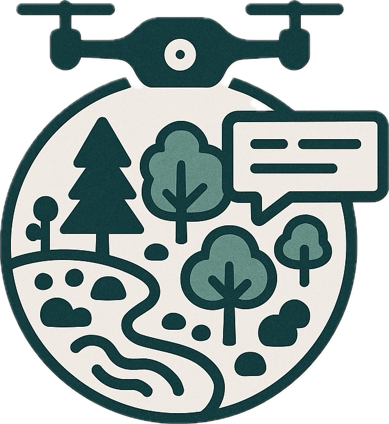
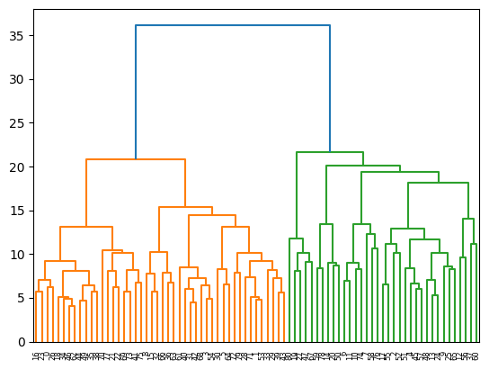
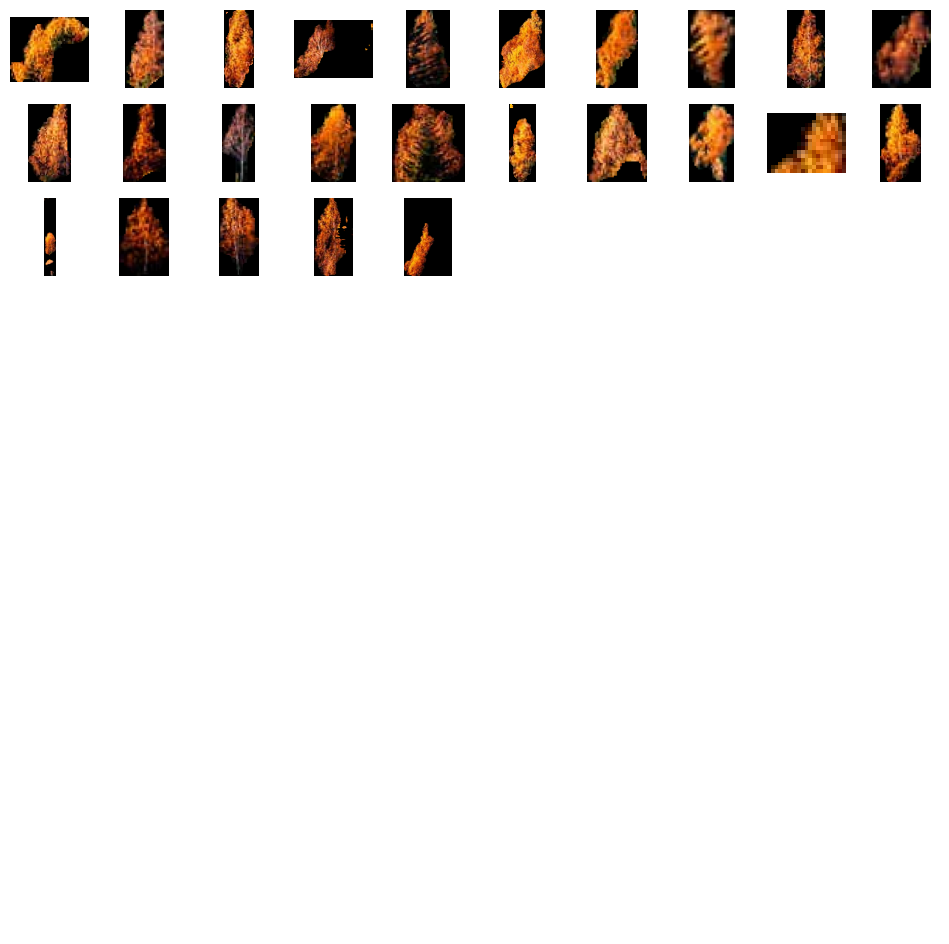
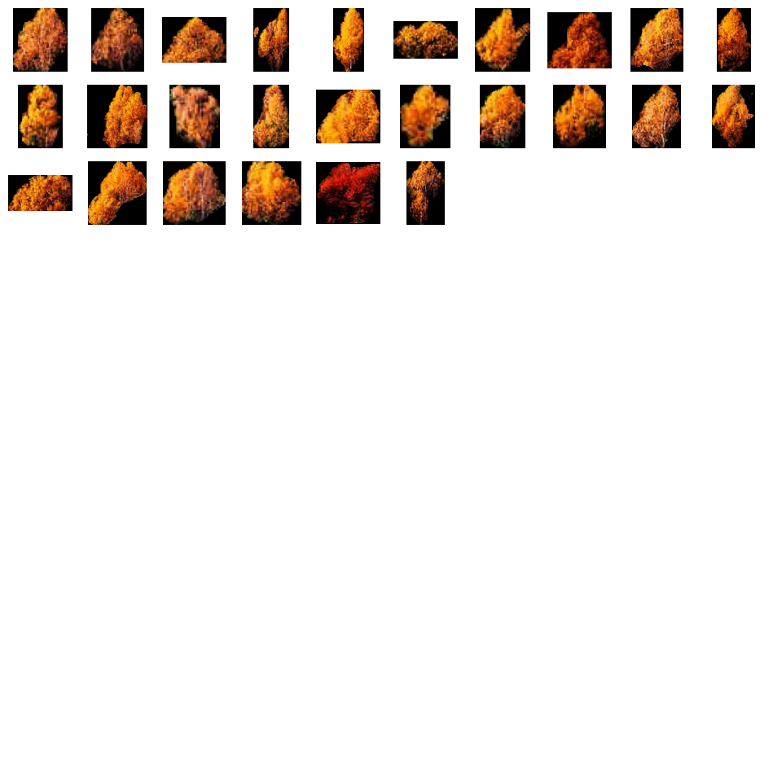
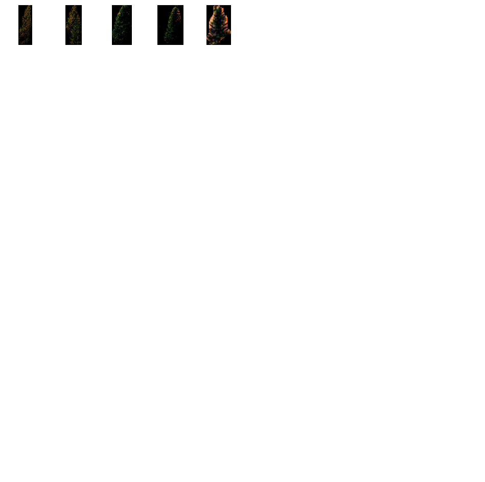
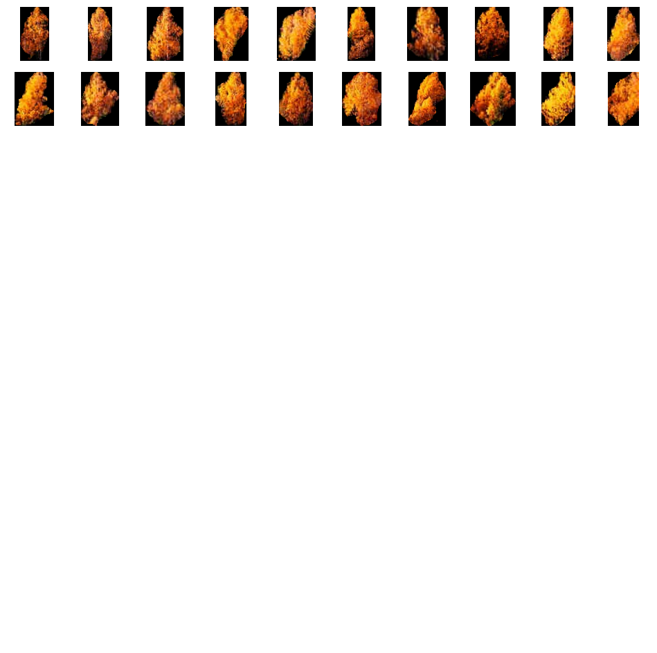
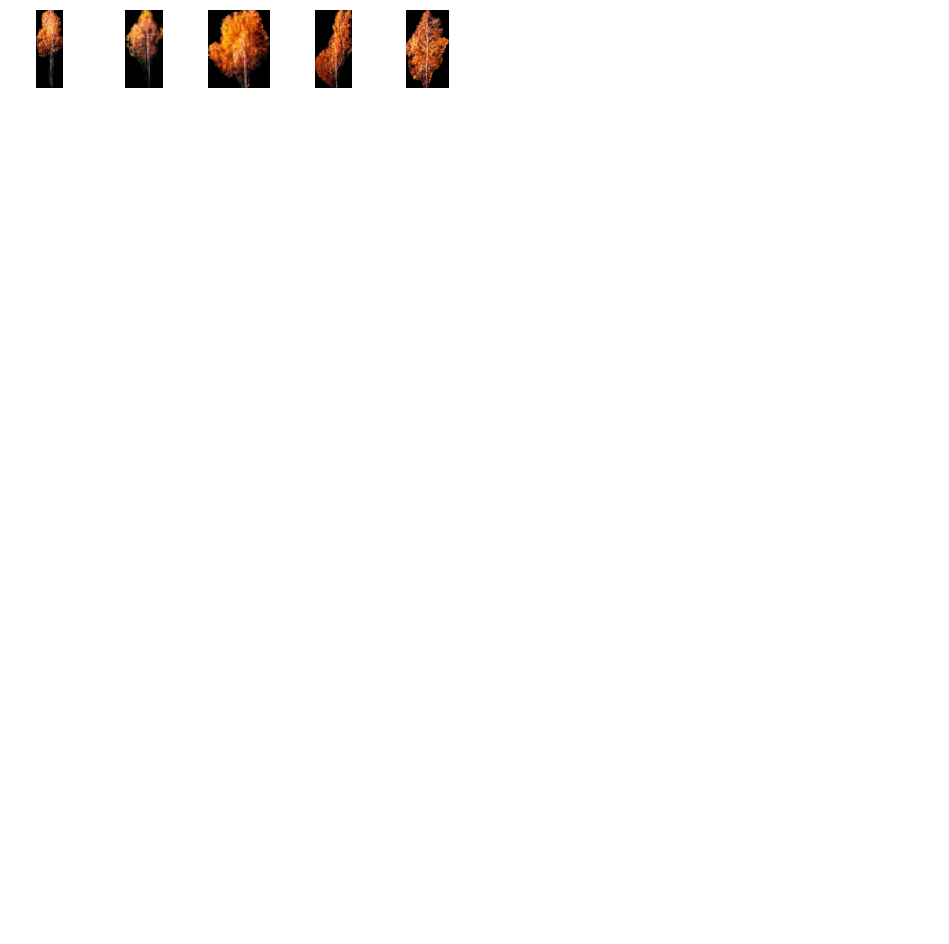

# ALIANTE

<p align="center">
  
</p>

**A**utomated **L**andscape **I**mage **A**nalysis with **N**eural **T**echnology and **E**cosystems

A distributed system for automated biodiversity analysis of drone-captured images using Vision Language Models (VLMs) and image segmentation. The platform integrates drone simulation, image storage, AI-powered analysis, and a web-based interface for ecosystem assessment.

## Overview

ALIANTE is a microservices-based platform that enables automated analysis of aerial imagery for biodiversity assessment. The system combines:

- **Drone Simulation**: ArduPilot SITL (Software In The Loop) for realistic drone flight simulation
- **Image Processing**: Automated image storage and retrieval with support for segmentation metadata
- **AI Analysis**: OpenAI-powered vision models for biodiversity assessment with SAM3 integration
- **Clustering**: Post-processing service for grouping similar image segments
- **Web Interface**: React-based frontend for uploading images and viewing analysis results
- **MCP Integration**: Model Context Protocol server for exposing services to AI agents

## Architecture

The system is composed of several microservices orchestrated via Docker Compose:

```
┌─────────────────┐
│  Web Frontend   │ (React + Vite)
│  (Port 3000)    │
└────────┬────────┘
         │
         ▼
┌─────────────────┐
│ Tree Analyzer   │ (Node.js + Express)
│ Service         │
│ (Port 4000)     │◄─── OpenAI API
└────────┬────────┘
         │
         ├──► Image Storage Service (Port 4100)
         │
         └──► Clustering Service (Port 5051)
                  │
                  └──► SAM3 Segmentation (External MCP)
         │
┌────────┴────────┐
│  Drone Simulator│ (ArduPilot SITL)
│  + Servient     │
│  (Port 19080)   │
└─────────────────┘
         │
         └──► Zion TDD (Port 28081)
```

### Core Services

#### 1. **Drone Simulator** (`drone/`)
- ArduPilot SITL environment for drone flight simulation
- MAVLink communication via mavlink2rest
- Configurable home position, vehicle type, and simulation parameters

#### 2. **Drone Node Servient** (`servients/drone-node/`)
- Node-WoT (Web of Things) servient exposing drone as a Thing
- RESTful API for drone control (arm, takeoff, goto, land, etc.)
- Real-time telemetry (position, battery, mode, armed status)
- Integration with Zion TDD for Thing Description registration

#### 3. **Image Storage Service** (`image-storage-service/`)
- REST API for image upload and retrieval
- Multer-based file handling with UUID-based naming
- Public URL generation for hosted images
- Health check endpoint

#### 4. **Tree Analyzer Service** (`tree-analyzer-service/`)
- Biodiversity analysis using OpenAI Vision API
- SAM3 segmentation integration via MCP
- Aggregates visual analysis with segmentation metadata
- Forwards segmentation data to clustering service

#### 5. **Clustering Service** (`postprocessing/`)
- Flask-based service for image segment clustering
- Uses SigLIP embeddings and Agglomerative Clustering
- Processes SAM3 segmentation results
- Groups similar image crops for pattern analysis

<p align="center">
  
  <br/>
  <em>High-level clustering summary showing inter-species relationships.</em>
</p>

<p align="center">
  
  
  
</p>
<p align="center">
  
  
  
</p>

#### 6. **Web Frontend** (`tree-analyzer-web/`)
- React application with Vite
- Image upload interface
- Customizable analysis prompts
- Results visualization with observations and recommendations
- SAM3 segmentation metadata display

#### 7. **Biodiversity MCP Server** (`mcp/biodiversity-mcp/`)
- Model Context Protocol server exposing services as tools
- Tools: `upload_drone_image`, `analyze_biodiversity_image`, `list_hosted_images`
- Compatible with ChatGPT, Claude, and other MCP clients

#### 8. **Zion TDD** (External)
- Thing Description Directory for WoT device registration
- PostgreSQL-backed storage
- JWT-based authentication

## Features

- **Drone Control**: Full flight control via WoT servient (arm, takeoff, waypoint navigation, landing)
- **Image Analysis**: AI-powered biodiversity assessment with customizable prompts
- **Segmentation**: SAM3 integration for object detection and segmentation
- **Clustering**: Automatic grouping of similar image segments
- **Web Interface**: User-friendly React frontend for image upload and analysis
- **MCP Integration**: Expose services to AI agents via Model Context Protocol
- **Docker Compose**: One-command deployment of all services
- **Health Monitoring**: Health check endpoints for service status

## Prerequisites

- **Docker** and **Docker Compose** (v2.0+)
- **Node.js** 20+ (for local development)
- **Python** 3.9+ (for local development)
- **OpenAI API Key** (for image analysis)
- **SAM3 MCP Server** (optional, for segmentation)

## Installation

1. **Clone the repository**:
   ```bash
   git clone <repository-url>
   cd ALIANTE
   ```

2. **Set environment variables**:
   Create a `.env` file in the root directory:
   ```env
   OPENAI_API_KEY=your_openai_api_key_here
   OPENAI_MODEL=gpt-4o-mini
   SAM3_MCP_URL=https://lauz.lab.students.cs.unibo.it/gradio_api/mcp/sse
   IMAGE_PUBLIC_BASE_URL=http://127.0.0.1:4100
   ```

3. **Start all services**:
   ```bash
   docker-compose up -d
   ```

4. **Verify services are running**:
   ```bash
   docker-compose ps
   ```

## Configuration

### Service Ports

| Service | Port | Description |
|--------|------|-------------|
| Web Frontend | 3000 | React application |
| Tree Analyzer | 4000 | Analysis API |
| Image Storage | 4100 | Image upload/retrieval |
| Clustering | 5051 | Post-processing service |
| Drone Servient | 19080 | WoT API |
| Zion TDD | 28081 | Thing Directory |
| MAVProxy | 5770 | Drone telemetry |

### Environment Variables

#### Tree Analyzer Service
- `OPENAI_API_KEY`: Required. Your OpenAI API key
- `OPENAI_MODEL`: Optional. Model to use (default: `gpt-4o-mini`)
- `SAM3_MCP_URL`: Optional. SAM3 MCP server endpoint
- `CLUSTERING_URL`: Optional. Clustering service URL (default: `http://clustering:5051/receive`)

#### Image Storage Service
- `PORT`: Optional. Service port (default: `4100`)
- `STORAGE_DIR`: Optional. Storage directory (default: `uploads` for local dev, `/data/uploads` in Docker)
- `PUBLIC_BASE_URL`: Optional. Public base URL for images

#### Drone Node Servient
- `DRONE_NAME`: Optional. Drone identifier (default: `drone`)
- `SYSID`: Optional. MAVLink system ID (default: `1`)
- `WOT_PORT`: Optional. WoT server port (default: `8080`)
- `M2R_BASE`: Optional. mavlink2rest base URL
- `TDD_URL`: Optional. Zion TDD URL (default: `http://zion:3000`)

## Usage

### Web Interface

1. Open your browser to `http://localhost:3000`
2. Click "Choose drone snapshot" to upload an image
3. Optionally modify the biodiversity analysis prompt
4. Click "Upload & Analyze" to start the analysis
5. View results including:
   - Focus area
   - Summary
   - Observations list
   - Recommended actions
   - SAM3 segmentation metadata

### API Endpoints

#### Image Storage Service

**Upload Image**:
```bash
POST /api/images
Content-Type: multipart/form-data

Form data:
  image: <file>
```

**List Images**:
```bash
GET /api/images
```

**Health Check**:
```bash
GET /api/health
```

#### Tree Analyzer Service

**Analyze Biodiversity**:
```bash
POST /api/biodiversity
Content-Type: application/json

{
  "imageUrl": "http://localhost:4100/images/1234567890-abc.jpg",
  "prompt": "Assess biodiversity of the forest canopy and highlight key species."
}
```

**Health Check**:
```bash
GET /api/health
```

#### Drone Servient (WoT)

The drone is exposed as a WoT Thing. The Thing title is `${DRONE_NAME}-thing` (default: `drone1-thing` when `DRONE_NAME=drone1`).

Access the Thing Description and interact with the Thing at:
```
http://localhost:19080/drone1-thing
```

**Example Actions**:
- `POST /drone1-thing/actions/arm`
- `POST /drone1-thing/actions/takeoff` with `{"alt": 10}`
- `POST /drone1-thing/actions/goto` with `{"lat": 44.494, "lon": 11.342, "alt": 20}`
- `POST /drone1-thing/actions/land`

**Properties**:
- `GET /drone1-thing/properties/armed`
- `GET /drone1-thing/properties/position`
- `GET /drone1-thing/properties/battery`

Note: The exact path may vary depending on Node-WoT configuration. Check the servient logs for the actual Thing URL.

### MCP Server

The MCP server exposes three tools:

1. **`upload_drone_image`**: Upload a base64-encoded image
2. **`analyze_biodiversity_image`**: Analyze an image with a custom prompt
3. **`list_hosted_images`**: List all stored images

Connect to the MCP server at `http://localhost:3030/mcp` from compatible clients (ChatGPT, Claude, VS Code MCP, etc.).

## Development

### Local Development

#### Backend Services

```bash
# Image Storage Service
cd image-storage-service
npm install
npm start

# Tree Analyzer Service
cd tree-analyzer-service
npm install
npm start

# Clustering Service
cd postprocessing
pip install -r requirements.txt
python clustering.py
```

#### Frontend

```bash
cd tree-analyzer-web
npm install
npm run dev
```

#### Drone Servient

```bash
cd servients/drone-node
npm install
node index.js
```

Note: The servient requires mavlink2rest and the drone simulator to be running.

### Building Docker Images

```bash
# Build all services
docker-compose build

# Build specific service
docker-compose build tree-analyzer
```

### Testing

Health check endpoints are available for services:
- Image Storage: `http://localhost:4100/api/health`
- Tree Analyzer: `http://localhost:4000/api/health`
- Clustering: Endpoint `/receive` available at `http://localhost:5051/receive` (POST only)

## Project Structure

```
ALIANTE/
├── drone/                 # ArduPilot SITL Docker setup
│   ├── Dockerfile
│   └── entrypoint.sh
├── servients/
│   └── drone-node/        # Node-WoT servient for drone control
│       ├── index.js
│       └── package.json
├── image-storage-service/ # Image upload/retrieval service
│   ├── src/
│   │   └── server.js
│   ├── Dockerfile
│   └── package.json
├── tree-analyzer-service/ # Biodiversity analysis service
│   ├── src/
│   │   └── server.js
│   ├── Dockerfile
│   └── package.json
├── tree-analyzer-web/     # React frontend
│   ├── src/
│   │   └── App.jsx
│   ├── Dockerfile
│   └── package.json
├── postprocessing/        # Clustering service
│   ├── clustering.py
│   ├── Dockerfile
│   └── requirements.txt
├── mcp/
│   └── biodiversity-mcp/  # MCP server
│       ├── index.js
│       └── package.json
├── scripts/               # Utility scripts
│   ├── drone_tunnels.sh
│   └── mp_multi.sh
├── docker-compose.yml     # Service orchestration
└── README.md
```

## Troubleshooting

### Services not starting

1. Check Docker logs:
   ```bash
   docker-compose logs <service-name>
   ```

2. Verify environment variables are set correctly

3. Ensure ports are not already in use

### OpenAI API errors

- Verify `OPENAI_API_KEY` is set and valid
- Check API quota and rate limits
- Ensure model name is correct

### Image upload failures

- Check `STORAGE_DIR` permissions in Docker volume
- Verify `PUBLIC_BASE_URL` matches your setup
- Check file size limits (default: 25MB)

### Drone connection issues

- Verify mavlink2rest is running and accessible
- Check MAVLink system ID matches configuration
- Ensure Zion TDD is running for Thing registration

## License

[Specify your license here]

## Contributing

[Add contribution guidelines if applicable]

## Acknowledgments

- ArduPilot project for drone simulation
- OpenAI for vision model capabilities
- Node-WoT for Web of Things implementation
- SAM3 for image segmentation
